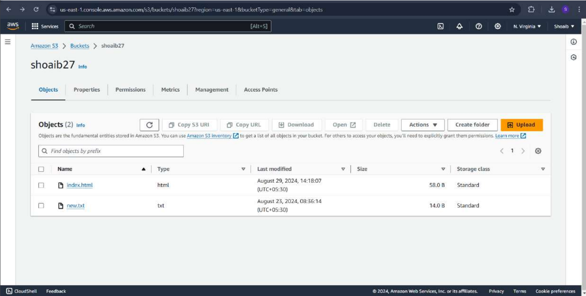
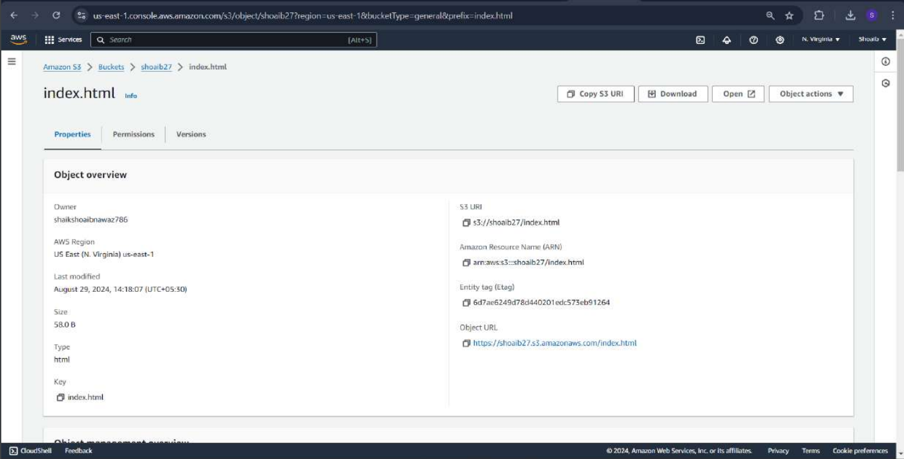
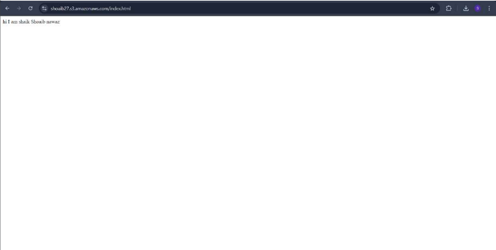
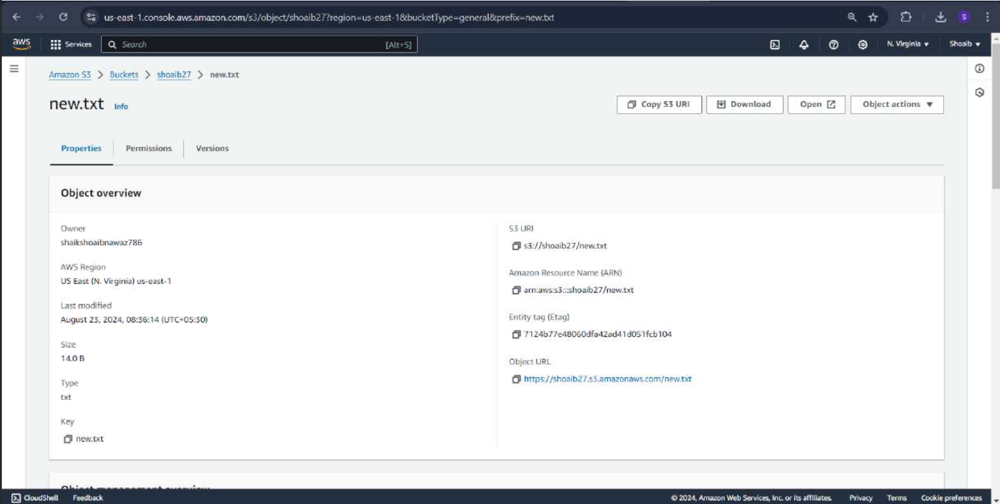
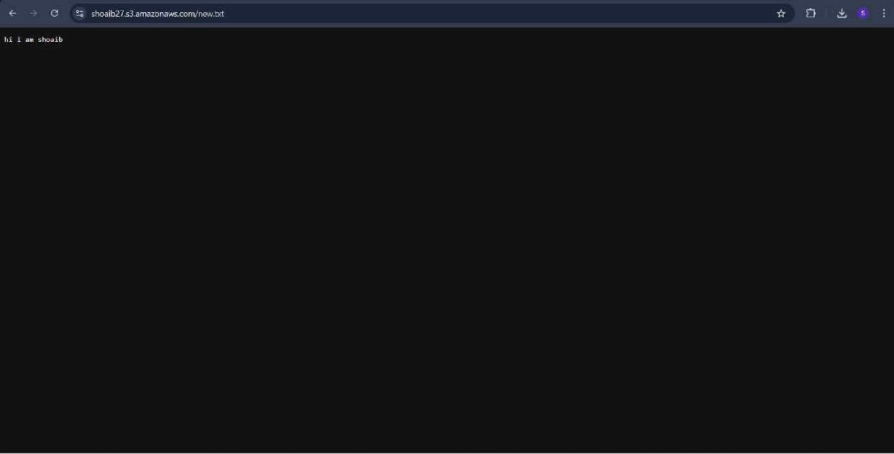
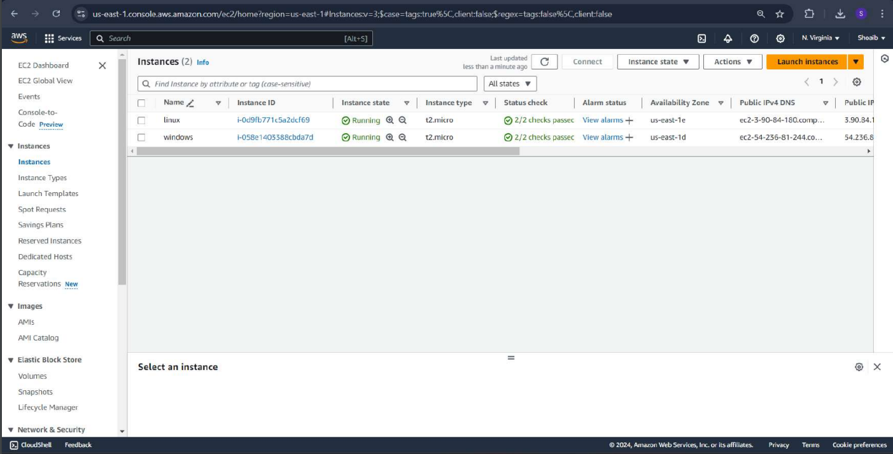
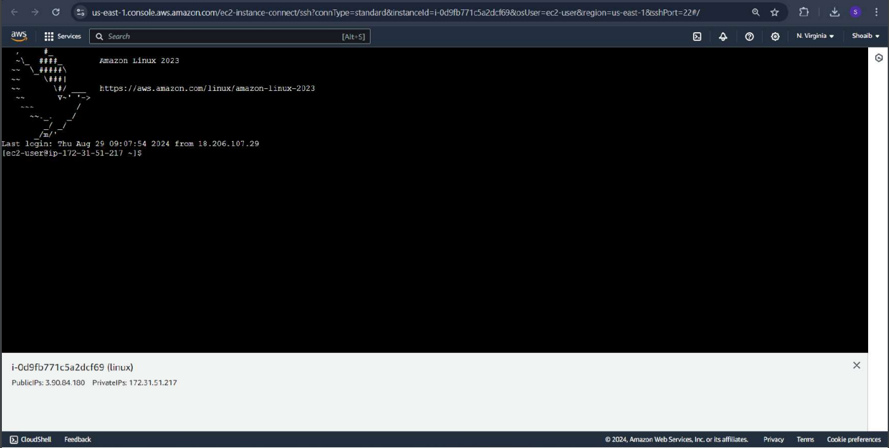
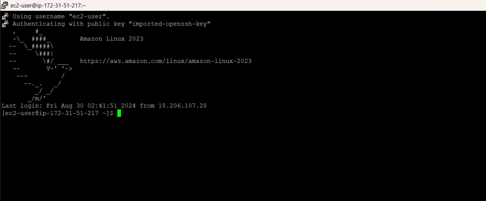
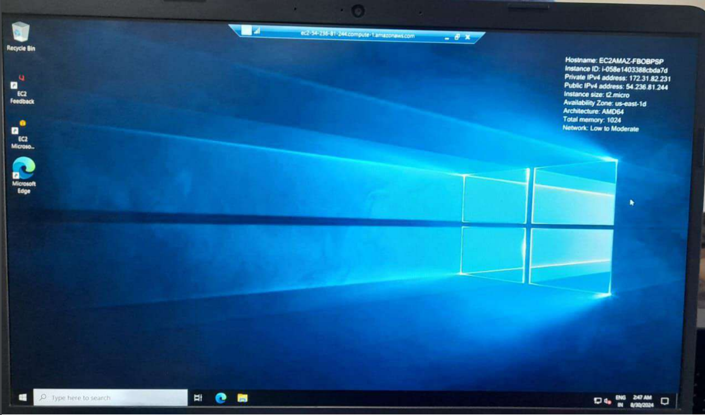

# CREATE S3 BUCKET AND EC2 INSTANCES FOR LINUX AND WINDOWS
## AIM :
To create an S3 bucket and EC2 instances for both Linux and Windows operating systems on AWS.

## PROBLEM STATEMENT :
This experiment demonstrates the process of setting up cloud infrastructure on AWS by creating an S3 bucket for storage and EC2 instances to host Linux and Windows environments. The goal is to provide an overview of how to configure and interact with these resources effectively, along with commands and screenshots to document the process.

## ALGORITHM :
Step 1:
Log in to AWS Console

Step 2: Create an S3 Bucket
Navigate to the S3 service.
Click on Create bucket.
Enter a Bucket name and select a Region.
Configure Bucket settings as required (e.g., versioning, public access).
Click on Create bucket to finalize.

Step 3: Create an EC2 Instance (Linux)
Go to the EC2 service.
Click on Launch Instance.
Select an Amazon Machine Image (AMI) for Linux (e.g., Amazon Linux 2).
Choose an Instance Type (e.g., t2.micro for free tier).
Configure Instance Details, Storage, and Security Group.
Review and click Launch with a key pair (or create one if needed).

Step 4: Create an EC2 Instance (Windows)
Return to the EC2 service and click Launch Instance.
Select a Windows AMI (e.g., Windows Server 2019).
Choose the Instance Type.
Configure Instance Details, Storage, and Security Group.
Review and launch with a key pair (for future login).

Step 5: Verify and Connect to Instances
Verify the status of both instances in the EC2 dashboard.
Connect to the Linux instance using SSH.
Connect to the Windows instance using RDP.

## OUTPUT
### REG NUMBER: 212222240094
### NAME: Shaik Shoaib Nawaz
1.) S3 bucket creation

2.) EC2 instance creation

## RESULT
Thus, The creation of s3 bucket and EC2 instances for both Linux and Windows, demonstrating cloud resource management on AWS is successfully executed.

  

